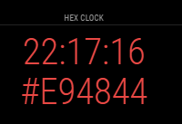

# MMM-MagicHexClock

A module for [MagicMirror²](https://github.com/MichMich/MagicMirror) that shows a clock in cool hexadecimal colors



## Install

1. Clone repository into `../modules/` inside your MagicMirror folder:
   - `git clone https://github.com/Lavve/MM-MagicHexClock`
2. Add the module to the MagicMirror config.js

```javascript
{
    module: "MMM-MagicHexClock",
    position: 'top_center',
    config: {
        fontSize: '65px',
        showHex: true,
        showTime: true,
        timeFormat: 24,
    }
},
```

## Configuration options

| Configuration | Default   | Description                                         |
| ------------- | --------- | --------------------------------------------------- |
| fontSize      | `65px`    | (str) Font size of the clocks                       |
| showHex       | `true`    | (bool) Show or hide the hexadecimal clock           |
| showTime      | `true`    | (bool) Show or hide the normal clock.               |
| timeFormat    | config.js | (int) `24` or `12`. Overrides settings in config.js |

## Collaborate

Pull requests are welcome.
